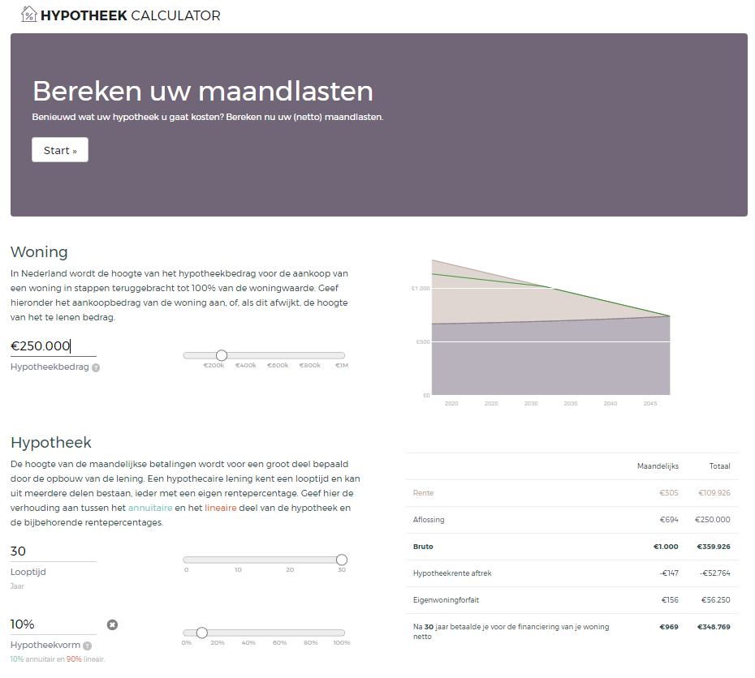

# Hypotheek calculator

Computes monthly payments for a Dutch mortgage loan. 




See it in action [here](https://nl-hugo.github.io/hypotheek-calculator/).


### Usage

To install:

```npm install```


To start in dev-mode:

```npm start```


To build:

```npm run build```


To deploy (after commit):

```npm run deploy```


### TODO

Known issues:

-[] round hypotheekbedrag and woz to 500 precision

-[] round interest to 0.05% precision

-[] round hypotheekvorm to 10% precision

-[] manual input of interest rates should accept e.g. 3.5 instead of 0.035

-[] linear/annuity interest rates re-appear after hiding them, without touching the hypotheekvorm slider

-[] overlap of input and slider on smaller screen sizes

-[x] chart should appear at the top on smaller screen sizes, not on the bottom

-[] reset button should be on top of the input field

-[] dynamic chart size?


### Resources

Inspired by the [buy-or-rent calculator](https://www.nytimes.com/interactive/2014/upshot/buy-rent-calculator.html?_r=0), published by the New York Times in 2014. 

Build on [D3.js](https://d3js.org/). The author's many [examples](https://bl.ocks.org/mbostock) proved a valuable resource. Amongst others: [bisect mouseover](https://bl.ocks.org/mbostock/3902569).

The icon is created by [Madebyoliver](http://www.flaticon.com/authors/madebyoliver) and published on [Flaticon](http://www.flaticon.com) and licenced under [CC 3.0 BY](http://creativecommons.org/licenses/by/3.0/).
